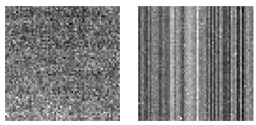

# OPS-SAT Image Denoiser
Denoising OPS-SAT images with TensorFlow Autoencoders.

## Motivation
The European Space Agency's [OPS-SAT](opssat1.esoc.esa.int/) spacecraft has a BST IMS-100 camera with CCD sensor and a design life of 3 years [[1](https://digitalcommons.usu.edu/cgi/viewcontent.cgi?article=1159&context=smallsat)]. OPS-SAT was launched on December 18, 2019. At the time of writing this README (April 30, 2023), the camera has been in orbit for over 4 months past its design life. To prepare against the risk of CCD sensor degradation that would result in acquiring grainy images, this experiment explores using AI to train neural network models as a denoising solution.

Past experiments have successfully demonstrated the use of TensorFlow models on-board the spacecraft's edge computer payload [[2](https://ieeexplore.ieee.org/document/9843402), [3](https://www.researchgate.net/publication/363599665_Augmenting_Digital_Signal_Processing_with_Machine_Learning_techniques_using_the_Software_Defined_Radio_on_the_OPS-SAT_Space_Lab), [4](https://digitalcommons.usu.edu/smallsat/2022/all2022/65/)], notably with the [SmartCam app](https://github.com/georgeslabreche/opssat-smartcam). Training a neural networks model using TensorFlow for on-board inferences has since been common practice by the OPS-SAT mission control team, particularly for autonomous decision-making in image classification. This experiment builds on those successes to train a denoising TensorFlow Lite model that can be plugged into the [SmartCam's inference pipeline](https://github.com/georgeslabreche/opssat-smartcam#33-building-an-image-classification-pipeline) to "fix" potentially grainy images. Denoising on-board rather than on the ground allows for image-based on-board autonomous decision-making that requires high fidelity imagery with little to no loss of pixel data.


## Implementations

### Autoencoders

The Autoencoders implemented for this experiment are taken from TensorFlow's [Intro to Autoencoders](https://www.tensorflow.org/tutorials/generative/autoencoder) as well as from a [Keras example](https://keras.io/examples/vision/autoencoder/). The source code of the Autoencoders can be found [here](autoencoders.py). To simulate fixed-pattern noise for CCD, a normal distribution is used to artificially add noise to the training and test data. The noiser is an executable binary implemented in C and can be found [here](./tools/noiser/).



**Figure 1: FPN noise for CCD (left) and CMOS (right) noise [[5](https://www.semanticscholar.org/paper/A-Novel-Fixed-Pattern-Noise-Reduction-Technique-in-Mohammadnejad-Nasiri/7b9a47d68a8da2f412466662dd9dbb10d3a23a36)].**

## Results
This experiment is a naive implementation of TensorFlow Autodecoders with little training data (~500 images) so the results leave much to be desired. Regardless, the experiment is an interesting proof-of-concept that can run on-board ESA's OPS-SAT spacecraft as well as any other spacecraft equipped with edge computing.

### Naive Denoiser

**Figure 2: Result from using a naive implementaton of the denoiser autoencoder.**

### Simple Denoiser

**Figure 3: Result from using a simple implementaton of the denoiser autoencoder.**

### Generative adversarial networks (GANs)

Working on

## Future Work
Suggested future work:
1. Improve denoising results with more training data. If not enough training images are availble from OPS-SAT then the Random Forest experiment in [[4](https://digitalcommons.usu.edu/smallsat/2022/all2022/65/)] demonstrated that [Landsat](https://landsat.gsfc.nasa.gov/) images can also be used as training data for models that apply to OPS-SAT imagery.
2. Re-use proven denoising models, such as the Pyramid Real Image Denoising Network (PRIDNet) [[6](https://arxiv.org/abs/1908.00273)]. These models weren't trained with satellite imagery in mind but are likely to yield good results and demonstrate the benefits of open-source reusability that edge computing allows on board a spacecraft. The disk footprint size of these models will present a challenge as they need to be reduced for spacecraft uplink (or apply only on the ground after image downlink).
3. Train a denoising model using noise distribution that is representative of a CMOS sensor vertical scan (due to the sensor's perpendicular readout system).
4. A comparative study and trade-off analysis against existing denoising algorithms that are not AI-driven.
5. Explore removing noise from radiation damage on camera sensors for future missions exposed to high levels of radiation such as with interplanetary radiation belts or Io's surface radiation in the Jupiter system.

## References
[1] Segert T., Engelen S., Buhl M., & Monna B. (2011). [Development of the Pico Star Tracker ST-200 – Design Challenges and Road Ahead](https://digitalcommons.usu.edu/cgi/viewcontent.cgi?article=1159&context=smallsat). _25th Annual Small Satellite Conference_, Logan, UT, USA.

[2] Labrèche, G., Evans, D., Marszk, D., Mladenov, T., Shiradhonkar, V., Soto, T., & Zelenevskiy, V. (2022). [OPS-SAT Spacecraft Autonomy with TensorFlow Lite, Unsupervised Learning, and Online Machine Learning](https://ieeexplore.ieee.org/document/9843402). _2022 IEEE Aerospace Conference_, Big Sky, MT, USA,

[3] Mladenov T., Labrèche G., Syndercombe T., & Evans D. (2022). [Augmenting Digital Signal Processing with Machine Learning techniques using the Software Defined Radio on the OPS-SAT Space Lab](https://www.researchgate.net/publication/363599665_Augmenting_Digital_Signal_Processing_with_Machine_Learning_techniques_using_the_Software_Defined_Radio_on_the_OPS-SAT_Space_Lab). _73rd International Astronautical Congress_, Paris, France.

[4] Kacker S., Meredith A., Cahoy K., & Labrèche G. (2022). [Machine Learning Image Processing Algorithms Onboard OPS-SAT](https://digitalcommons.usu.edu/smallsat/2022/all2022/65/). _36th Annual Small Satellite Conference_, Logan, UT, USA.

[5] Mohammadnejad, S., Nasiri, M., Roshani, S., & Roshani, S. (2012). [A Novel Fixed Pattern Noise Reduction Technique in Image Sensors for Satellite Applications](https://www.semanticscholar.org/paper/A-Novel-Fixed-Pattern-Noise-Reduction-Technique-in-Mohammadnejad-Nasiri/7b9a47d68a8da2f412466662dd9dbb10d3a23a36). _Electrical and Electronic Engineering_, 2(5): 271-276.

[6] Zhao, Y., Jiang, Z., Men, A., & Ju, G. (2019). [Pyramid Real Image Denoising Network](https://arxiv.org/abs/1908.00273).


## Appendix: Getting Started
Instructions on how to install the application to train and apply the denoiser autoencoder model. Training images are not provided.

### Installation

Install and create the virtual environment:
```bash
sudo apt install python3-venv
pip install virtualenv
virtualenv venv
```

Activate the virtual environment in Linux:
```bash
source venv/bin/activate
```

Make sure you are in the last version:
```bash
python3 -m pip install --upgrade build
```

Install Pytest:
```bash
pip install pytest
```

Make sure that you pass all the test:
```bash
pytest
```

Compile the last version:
```bash
python3 -m build
```

Install using pip:
```bash
pip install dist/image_denoiser_cguz-0.0.1-py3-none-any.whl
```

Deactivate the virtual environment:
```bash
deactivate
```

### Execution
Activate the virtual environment and:
1. Use `find_bad_jpegs.py` to identify corrupt images that will break the training (get rid of those images, if they exist).
2. Edit `constants.py` with the desired training parameters.
3. Train the model with `train_denoiser.py`.
4. Test the model on some images with `denoise.py`.